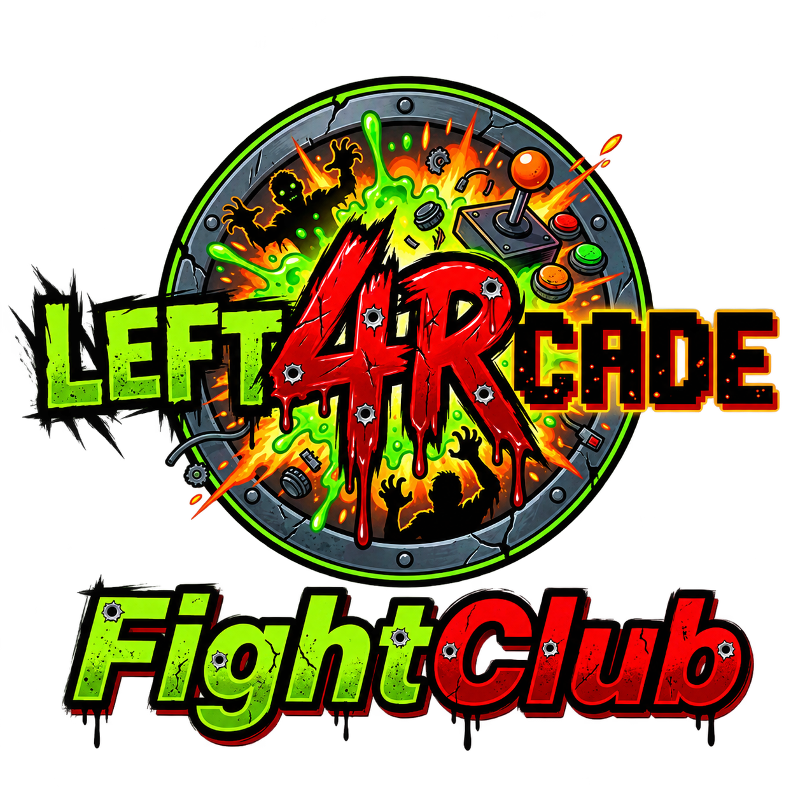

  

# Left4RCade

> **Classic arcade fighters. Modern rollback netcode.**

Left4RCade is a **Fightcade-inspired online arcade platform** focused on bringing classic fighting games together with modern, low-latency online multiplayer.

Powered by **custom GGPO-based rollback netcode**, Left4RCade aims to deliver responsive online matches while preserving the feel of the original arcade experience.

## 🎮 Supported Games

The following games are currently supported by Left4RCade:

* Tecmo World Cup 98
* Street Fighter EX
* Street Fighter EX Plus
* Street Fighter EX2
* Street Fighter EX2 Plus
* Rival Schools
* Tekken 3
* Tekken Tag Tournament

More games will be added based on technical feasibility, development priorities, and community demand.

## 🎮 Request a Game

Have a classic arcade fighting game you'd like to see on Left4RCade?

**[➡️ Request a Game](https://github.com/left4rcade/left4rcade/issues/new?template=game-request.yml)**

Before creating a request, please check whether the game has already been requested. If it already exists, use the **👍 reaction** on the existing request instead of creating a duplicate.

### 🔥 Community Game Requests

**[🔥 View game requests by popularity](https://github.com/left4rcade/left4rcade/issues?q=is%3Aissue+is%3Aopen+label%3Agame-request&sort=reactions-desc)**

**[🆕 View newest game requests](https://github.com/left4rcade/left4rcade/issues?q=is%3Aissue+is%3Aopen+label%3Agame-request&sort=created-desc)**

**[🔎 Search all game requests](https://github.com/left4rcade/left4rcade/issues?q=is%3Aissue+is%3Aopen+label%3Agame-request)**

Community interest will help guide future game support and development priorities.

> **How voting works:** Find an existing game request and click **👍**. No duplicate request is needed.

### 📋 Request Lifecycle

Game requests are handled through a simple community-driven workflow:

1. **🔥 Requested** — A player submits a game request.
2. **🔎 Under Review** — The team evaluates technical feasibility, arcade hardware, emulation requirements, netcode considerations, and community interest.
3. **📌 Planned** — The game is approved for future development.
4. **🚧 In Development** — Implementation and testing are underway.
5. **✅ Supported** — The game is available on Left4RCade.

Requests may also be closed as **❌ Not Planned** when technical, legal, licensing, or development constraints make support impractical.

**Voting is only used to measure community demand.** A high vote count does not automatically guarantee implementation; technical feasibility and development priorities also matter.

## ⚡ Features

* Custom GGPO-based rollback netcode
* Low-latency online multiplayer
* Arcade-focused experience
* Support for classic fighting games
* Room / matchmaking infrastructure
* Cross-region online play
* Designed for competitive play
* Community-driven development

## 🧠 Netcode

Left4RCade uses a custom implementation built around **rollback networking principles inspired by GGPO**.

The goal is simple:

**Minimize latency. Maximize responsiveness.**

Instead of relying purely on traditional delay-based networking, Left4RCade is designed to keep gameplay responsive even when players are geographically separated.

## 🚀 Project Status

Left4RCade is currently under active development.

Game support, networking features, matchmaking, frontend functionality, and infrastructure are continuously being improved.

## 🗺️ Roadmap

* [x] Core platform development
* [x] Initial rollback networking implementation
* [ ] More game support
* [x] Improved matchmaking
* [x] Ranked matches
* [x] Player profiles
* [x] Leaderboards
* [ ] Tournament support
* [x] Spectator mode
* [x] Replay system
* [ ] Anti-cheat improvements
* [x] Dedicated server infrastructure
* [ ] Public beta

## 🤝 Sponsorship & Partnerships

Left4RCade is open to **sponsorships, partnerships, commercial licensing, and investment opportunities**.

If you are interested in supporting the project, integrating Left4RCade into an existing product, or discussing commercial opportunities, please get in touch.

## 💼 Commercial Opportunities

Left4RCade is available for discussion regarding:

* Sponsorship
* Strategic partnerships
* Commercial licensing
* Technology licensing
* Platform integration
* Investment
* Acquisition

For business inquiries, please contact the project owner.

## 📜 License

**All Rights Reserved.**

The Left4RCade source code is publicly available for transparency, development, and community discussion.

No permission is granted to commercially exploit, redistribute, sublicense, or create derivative works from this project without explicit permission from the copyright holder.

For commercial licensing or other usage inquiries, please contact the project owner.

## ⚠️ Disclaimer

Left4RCade is an independent project and is not affiliated with, endorsed by, or sponsored by the owners of the games, trademarks, or other third-party intellectual property referenced by this project.

All trademarks and copyrights belong to their respective owners.

## ⭐ Support the Project

If you find Left4RCade interesting, consider giving the repository a ⭐ on GitHub.

Your support helps increase the project's visibility and reach more developers, players, and potential contributors.

---

**Left4RCade — Bringing classic arcade fighters online.**
